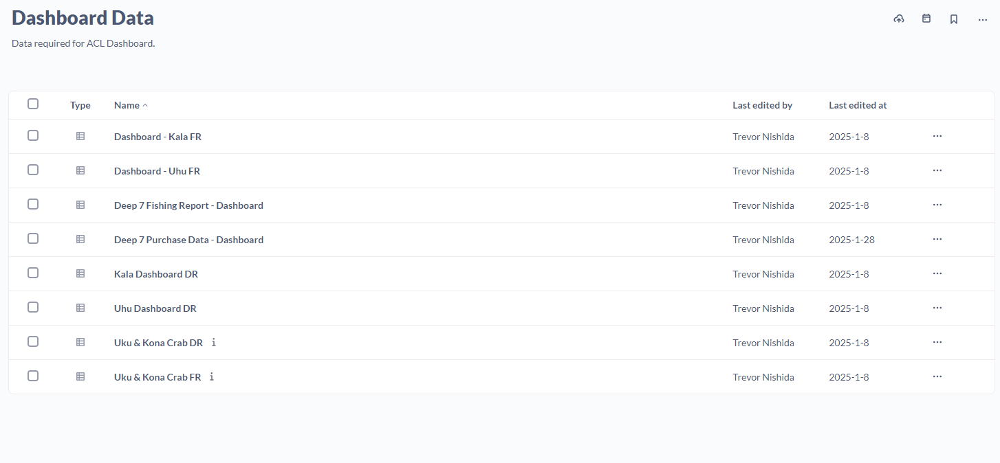
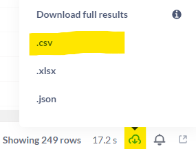
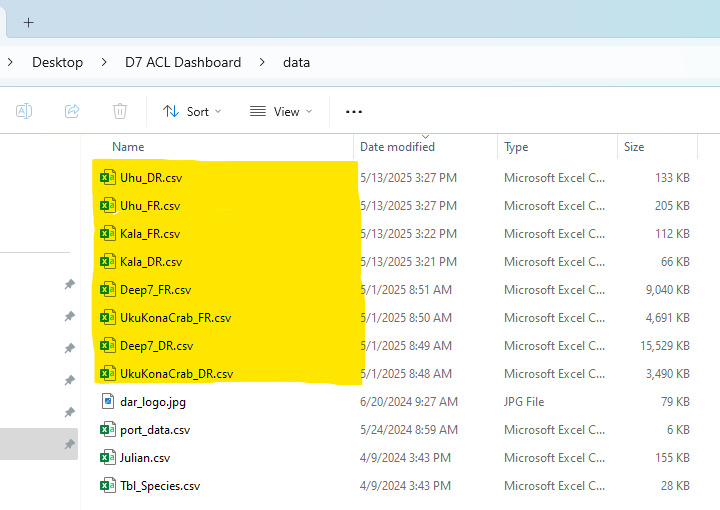
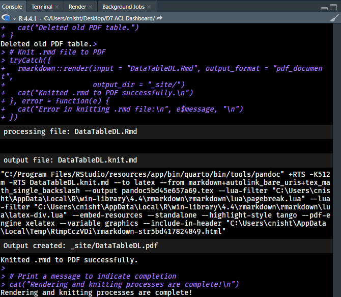

# Introduction

This Standard Operating Procedure (SOP) outlines how to update and troubleshoot the annual catch limit commercial fisheries dashboard. This book is intended for the person responsible for maintaining and deploying the dashboard on a monthly basis. ACL monitoring is critical for both managers and fishers so they know when a fishery is approaching a limit and when harvest must stop. Monitoring of federally co-managed ACLs is performed by NOAA ‘s Pacific Islands Fisheries Science center. Hawai’i fisheries have several ACLs, and the most commercially important ones are displayed in this dashboard. The ACL monitoring dashboard was created to increase transparency and improve communication about ACL status with co-managers and the public. 


# Project Structure

```{r, echo=F}

```

The dashboard is composed of four individual Quarto pages:

- `index.qmd`
- `deep_seven_dashboard.qmd`
- `kala_uhu_dashboard.qmd`
- `Uku_KonaCrab_dashboard.qmd`

Each page is named to clearly reflect the fishery or group of fisheries it covers. These files generate independent, fishery-specific dashboard views that allow for detailed tracking of catch metrics and seasonal progress. The `index.qmd` file functions as the main landing page and presents a consolidated overview, displaying gauge plots for all monitored fisheries in a single, user-friendly view. This enables quick status checks without needing to visit each individual fishery page.

In addition to the Quarto dashboard files, the project includes a supporting R Markdown file: `DataTableDL.Rmd`. This file produces a downloadable PDF containing a comprehensive table of catch and sale statistics for all fisheries. It serves as a useful reference tool for internal reporting and stakeholder communication, and can be regenerated as needed using current data.

Finally, the script `buildDashboard.R` automates the rendering process by compiling all Quarto (.qmd) and R Markdown (.Rmd) files. Running this script will regenerate the full suite of dashboard outputs and supporting materials, making updating the dashboard on a monthly basis no longer than a 15 minute process. 

# Initial Setup

## Requirements

- R (>= 4.2.0)
- RStudio
- Required packages:
  ```r
  install.packages(c("tidyverse", "lubridate", "scales", "ggforce", "ggrepel", "readr", "bookdown", "flextable", "officer", "tippy"))
  ```

## Load the Project

To begin working with the dashboard, open the `D7 ACL Dashboard.Rproj` file. This RStudio Project file sets the appropriate working directory automatically, ensuring that all file paths resolve correctly relative to the project root. Opening the project also provides quick access to the codebase by displaying all associated .qmd, .Rmd, and .R files within the RStudio environment, allowing for efficient editing and navigation.


# Updating the Dashboard

## Downloading up-to-date Data

```{r, echo=F}

```

The data powering this dashboard is sourced directly from Metabase. A dedicated folder within Metabase contains all the necessary queries used in generating the dashboard visualizations and summaries.

To update the data:

- Open each query in the Metabase folder.

- Click the Download button located in the bottom-right corner of the screen. 
  - It looks like a cloud with a down arrow
  
```{r, echo=F}

```

- Select the .csv option from the download format choices.

After downloading, rename each file to match the expected filenames used in the dashboard code. In most cases, the appropriate filename matches the title of the Metabase query. For example, the query titled "Deep 7 FR" should be saved as `Deep7_FR.csv`. Consistent naming is critical for the code to run without errors. If you are unsure of what to rename the file, check the "data" folder in the D7 ACL Dashboard folder.

## Replacing Dashboard Data

Once all CSV files have been downloaded and appropriately renamed, navigate to the data folder within the D7 ACL Dashboard project directory. Replace the existing CSV files by dragging and dropping the newly downloaded files into the folder. When prompted, select **"Replace the files in the destination"** to ensure the dashboard uses the most up-to-date data.


```{r, echo=F}

```


## Rendering the Dashboard

Once the data files have been placed into the data folder, navigate to the D7 ACL Dashboard directory and find the `buildDashboard.R` file. Once located, open the file up,  select all code (CTRL + A), and run all the code (CTRL + ENTER). This will knit each individual qmd file as well as deleting the old PDF data download before replacing it with a brand newly knitted one. During this time, the RStudio console will printout any errors which occur as well as printing a status message when the knitting is completed. 

```{r, echo=F}

```

# Uploading the Updated Dashboard

## Uploading to Github

Once the dashboard is completed being updated, navigate to the `_site` folder in the D7 ACL Dashboard directory. Also open up the GitHub repository which hosts the dashboard (https://github.com/darstats/dashboard). On the Github page, click "Add file" then "Upload files".
When the pages loads, drag the following ten items from the `_site` folder onto the Github drag-n-drop uploader. 

- deep_seven_dashboard_files
- index_files
- kala_uhu_dashboard_files
- site_libs
- Uku_KonaCrab_dashboard_files
- DataTableDL.pdf
- deep_seven_dashboard.html
- index.html
- kala_uhu_dashboard.html
- Uku_KonaCrab_dashboard.html

```{r, echo=F}

```

## Committing to Repository

Once the files have uploaded, scroll to the bottom of the Github page & add in a Commit message. Ex. "Updating dashboard for March 2025"
Then click "Commit Changes". 

## Checking the update

After the files have sucessfully committed, wait around 5 minutes before navigating to the dashboard (https://darstats.github.io/dashboard/). Once on the dashboard's live page ensure that the update has worked. (You may need to press refresh the page) (CTRL + SHIFT + R). If you are able to see the new data, the dashboard was sucessfully updated!

# Dynamic Date Configuration

Each dashboard automatically detects the current fishing year using `Sys.Date()` and adjusts the cutoff accordingly. This means no manual date editing is required for:

- ACL gauge plots
- Cumulative pound plots
- Monthly summaries

# Common Maintenance Tasks

## Update the ACL or ACT
Find the ACL/ACT variable in the `setup` chunk (e.g., `ACL <- 492000`) and change its value. Repeat for the fishery specific qmd file as well as the `index.qmd` file. 

## Close the fishery
Find the closure logic in the `setup` chunk (e.g., `uhuFisheryClosed <- FALSE`) and change its value to true. Repeat for the fishery specific qmd file as well as the `index.qmd` file. When the fishery season lapses, this logic will have to be returned to FALSE in order to begin updating as normal again. 

# Troubleshooting

## Plot Missing
- Ensure `Plot_day` is correctly calculated.
- Confirm data is not filtered out by `cutoffDate`.

## Missing Gauge or NaNs
- Check the filtering logic in the gauge prep section.
- Verify ACT is not zero or `NA`.

# Code Best Practices

- Avoid hardcoding years. 
- Use dynamic strings like `paste0("FY_", current_FY)`
- Label code sections clearly with `### ---- STEP ---- ###`.

# Appendix

## Glossary

- **ACL**: Annual Catch Limit
- **ACT**: Annual Catch Target
- **FY**: Fishing Year

## calc_julian function

```r
calc_julian <- function(dates, origin = "-01-01") {
  if (!inherits(dates, "Date")) dates <- as.Date(dates)
  origins <- as.POSIXlt(paste0(substring(dates, 1, 4), origin))
  origins$year <- origins$year - (as.Date(origins) > dates)
  as.numeric(dates - as.Date(origins) + 1L)
}
```


## Function to add closure date to ACL plots.

```r
add_fishery_closed_label <- function(plot_object, closed, cutoff_day, y_position, label_text = "Fishery Closed") {
  if (closed) {
    plot_object <- plot_object +
      ggrepel::geom_text_repel(
        data = tibble(Plot_day = cutoff_day, CumLbs = y_position),
        aes(x = Plot_day, y = CumLbs, label = label_text),
        size = 9, color = "red", nudge_x = 5, nudge_y = 500,
        min.segment.length = 0
      )
  }
  return(plot_object)
}
```

## Deep 7 Data Prep Function

```r
prepare_data <- function(df, date_col) {
  df %>%
    left_join(tbl_sp, by = c("food_species_code" = "SPECIES")) %>%
    mutate(SPEC_NAME = factor(SPEC_NAME, levels = c("OPAKAPAKA", "ONAGA", "EHU", "LEHI", "HAPUUPUU", "KALEKALE", "GINDAI")),
           # Use "!!" to remove quotes from character column and convert to date symbol with sym()
           Year = year(!!sym(date_col)),
           Month = month(!!sym(date_col)))
}
```

## Gauge Generation Function

```r
load_gauge_data <- function(label, caught, limit) {
  caught <- round(caught / limit, 3)
  tibble(
    fishery = label,
    part = c("Complete", "Incomplete"),
    percent = c(caught, 1 - caught),
    start = lag(c(caught, 1 - caught), default = 0) * pi,
    end = start + percent * pi
  )
}
```
